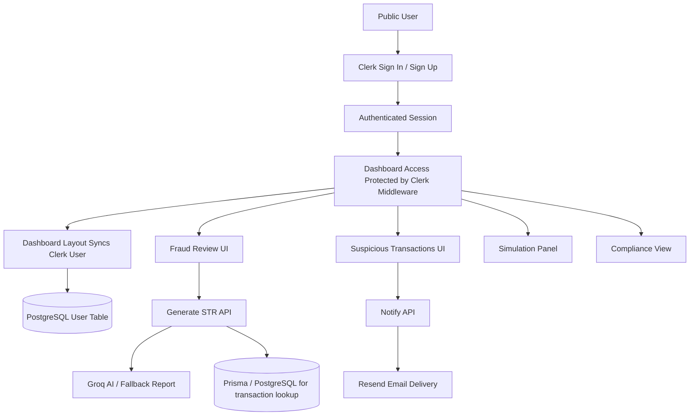
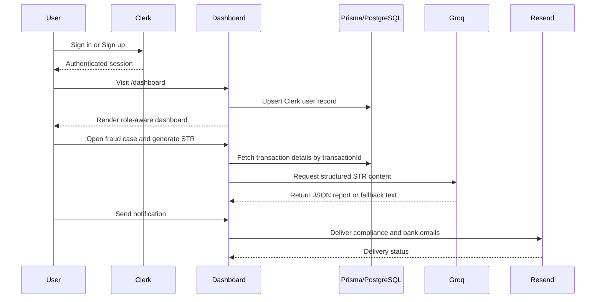

# TBML AML Dashboard Documentation

## 1. Project Overview

The TBML AML Dashboard is a trade-based anti-money-laundering and compliance workspace built with Next.js, Clerk authentication, Prisma, PostgreSQL, and AI-assisted report generation.

The application is designed to help compliance analysts:

- review confirmed fraud cases,
- inspect suspicious trade transactions,
- generate STR-style reports,
- notify originating banks and compliance teams,
- simulate transaction risk for testing and demonstrations.

The product combines public marketing pages with an authenticated analyst dashboard and server-side notification/report APIs.

## 2. Business Objective

The core objective of the application is to model a realistic trade finance compliance workflow for TBML detection.

The system focuses on:

- identifying invoice abuse and route anomalies,
- surfacing suspicious cross-border trade corridors,
- improving analyst review speed,
- supporting regulatory reporting and case escalation,
- storing authenticated users locally with roles for future authorization control.

## 3. Technology Stack

- Frontend: Next.js App Router, React, Tailwind CSS
- Authentication: Clerk
- Database: PostgreSQL
- ORM: Prisma
- Email / Notifications: Resend
- AI Report Generation: Groq API
- UI State: Zustand
- Toasts: Sonner
- Diagram support: Mermaid in Markdown

## 4. Application Structure

### Public Pages

- `/` - landing page with TBML-focused hero, animated background, and project summary
- `/about-us` - project background and mission
- `/contactus` - contact page
- `/sign-in` - Clerk sign-in flow
- `/sign-up` - Clerk sign-up flow

### Authenticated Pages

- `/dashboard` - analyst workspace containing fraud cases, suspicious transactions, simulation, and compliance sections

### API Routes

- `POST /api/str/generate` - generate STR-style report text
- `POST /api/str/notify` - send notifications to compliance and originating bank
- `POST /api/webhooks/clerk` - sync Clerk users into the local database

## 5. Authentication Flow

Authentication is handled by Clerk.

### Flow

1. User opens the public site.
2. User signs up or signs in through Clerk.
3. Clerk issues the authenticated session.
4. The app protects `/dashboard` using Clerk middleware.
5. On first access to the dashboard, the server syncs the Clerk user into the local `User` table.
6. Local user records are used for role-aware behavior.

### Relevant Files

- [src/app/layout.tsx](src/app/layout.tsx)
- [src/proxy.ts](src/proxy.ts)
- [src/app/dashboard/layout.tsx](src/app/dashboard/layout.tsx)
- [src/app/api/webhooks/clerk/route.ts](src/app/api/webhooks/clerk/route.ts)
- [src/lib/sync-clerk-user.ts](src/lib/sync-clerk-user.ts)
- [src/lib/getUserRole.ts](src/lib/getUserRole.ts)

## 6. Roles and Access Model

The system uses a simple role model stored in PostgreSQL.

### Roles

| Role | Purpose |
| --- | --- |
| `ADMIN` | Full access to compliance workspace and admin-only views |
| `BANK_USER` | Default role for newly synced users |

### Current Behavior

- New Clerk users are stored locally as `BANK_USER`.
- The helper `getUserRole()` reads the authenticated user role from the database.
- The compliance workspace in the dashboard is gated for `ADMIN` users in the current UI.

### Relevant File

- [prisma/schema.prisma](prisma/schema.prisma)

## 7. Database Design

### User Table

The `User` model stores Clerk identity and local authorization data.

Fields:

- `id` - internal UUID primary key
- `clerkId` - unique Clerk user id
- `email` - user email
- `name` - optional display name
- `role` - application role (`ADMIN` or `BANK_USER`)
- `createdAt` - creation timestamp
- `updatedAt` - last updated timestamp

### FlaggedTransaction Table

The `FlaggedTransaction` table stores confirmed high-risk TBML records.

Fields:

- `transaction_id` - primary key
- `sender_id`
- `receiver_id`
- `amount`
- `reasons_for_flagging`
- `confidence_score`
- `createdAt`

### Relevant File

- [prisma/schema.prisma](prisma/schema.prisma)

## 8. Data Flow Diagram

### High-Level Flow

### Detailed Data Flow

## 9. Endpoint Reference

### `POST /api/webhooks/clerk`

Purpose:
- Receives Clerk webhook events.
- Verifies the event signature.
- Syncs user data into the local database.

Behavior:
- Accepts `user.created` events.
- Extracts Clerk user id, email, and name.
- Upserts user by `clerkId`.
- Sets default role to `BANK_USER`.

Inputs:
- Clerk webhook payload
- Svix signature headers

Outputs:
- `200` on success
- `400` for missing payload details
- `500` for signature or server errors

### `POST /api/str/generate`

Purpose:
- Generates a Suspicious Transaction Report-style response for a case.

Behavior:
- Requires an authenticated user.
- Reads the user role from the database.
- Prefers database transaction details when `transactionId` is provided.
- Calls Groq for structured report generation.
- Falls back to local templated text if AI is unavailable.

Inputs:
- `transactionId`
- Optional manual transaction fields

Outputs:
- JSON object containing `executiveSummary`, `transactionDetails`, `riskIndicators`, `analyticalInsights`, `recommendation`, and `professionalNotice`

### `POST /api/str/notify`

Purpose:
- Sends fraud or suspicious-case notifications to compliance and originating banks.

Behavior:
- Uses Resend for email delivery.
- Supports both fraud account alerts and suspicious transaction inquiries.
- Validates payload shape before sending.
- Rejects placeholder bank emails when a real bank address is required.

Inputs:
- Fraud account payload with report
- Suspicious transaction payload

Outputs:
- Success response with email ids
- Error response if the email config or payload is invalid

## 10. Dashboard Behavior

The dashboard is composed of the following sections:

- Overview
- Flagged Fraud
- Suspicious Alerts
- Simulation Panel
- Compliance

### Section Logic

- Overview combines all core panels.
- Fraud section focuses on confirmed high-risk accounts.
- Suspicious section focuses on pending analyst review cases.
- Simulation section allows risk testing on synthetic transactions.
- Compliance section is limited to `ADMIN` users.

### Sidebar Navigation

The dashboard includes a sidebar with:

- section navigation,
- a TBML workspace card,
- a back-to-home action at the bottom.

### Relevant Files

- [src/app/dashboard/page.tsx](src/app/dashboard/page.tsx)
- [src/app/dashboard/layout.tsx](src/app/dashboard/layout.tsx)
- [src/components/dashboard/sidebar.tsx](src/components/dashboard/sidebar.tsx)

## 11. Transaction Simulation Flow

The simulation panel helps demonstrate detection logic without requiring live bank data.

### Flow

1. User selects legitimate or fraud simulation mode.
2. User enters sender, receiver, amount, commodity, route, and remarks.
3. System computes a risk score based on amount, route, and keywords.
4. A prediction is produced: Safe, Suspicious, or Fraud.
5. The timeline renders the simulated stages.

### Relevant File

- [src/components/dashboard/transaction-simulation-panel.tsx](src/components/dashboard/transaction-simulation-panel.tsx)

## 12. UI/UX Notes

The interface is intentionally designed to feel like a real compliance environment:

- animated background gradients on the homepage,
- glassmorphism panels,
- clear call-to-action hierarchy,
- dashboard sidebar navigation,
- role-aware compliance access,
- in-context report and notification actions.

## 13. Security and Validation Notes

- Clerk middleware protects the dashboard route.
- Webhook signature verification is used for Clerk events.
- Local user synchronization is keyed by `clerkId`.
- Bank and compliance email delivery uses validated addresses and explicit config.
- Admin-only areas should continue to use server-side role checks.

## 14. Setup Notes

Required environment variables include:

- `NEXT_PUBLIC_CLERK_PUBLISHABLE_KEY`
- `CLERK_SECRET_KEY`
- `CLERK_WEBHOOK_SECRET`
- `DATABASE_URL`
- `GROQ_API_KEY`
- `GROQ_MODEL`
- `RESEND_API_KEY`
- `RESEND_FROM_EMAIL`
- `COMPLIANCE_TEAM_EMAIL`

## 15. Summary

This application is a TBML compliance dashboard with authenticated user sync, role-aware access, AI-generated reporting, and notification workflows. The system is structured so it can evolve from a prototype into a more complete analyst workstation with minimal changes to the current architecture.
